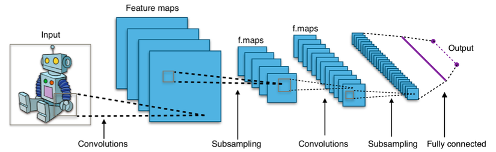

# Image Classification with Convolutional Neural Networks (CNN)

This project demonstrates **image classification using Convolutional Neural Networks (CNNs)** with Keras and TensorFlow.  
The goal is to classify traffic signs into **8 predefined categories** using an ideal (noise-free) dataset.  



For an introduction to CNNs, see: [Understanding CNNs](https://medium.com/@RaghavPrabhu/understanding-of-convolutional-neural-network-cnn-deep-learning-99760835f148)

---

## 📌 Project Overview
- **Dataset**: Traffic sign images divided into training and testing sets.  
- **Model**: A 6-layer CNN built using Keras.  
- **Training**: Model trained and weights saved in `.h5` format.  
- **Prediction**: Classifies new images and outputs results into a CSV file.  

---

## 1. Data Loading

We use **Keras `ImageDataGenerator`**, which provides convenient data augmentation techniques such as resizing, rotation, flipping, and zooming to improve generalization.

📖 Documentation: [ImageDataGenerator](https://keras.io/preprocessing/image/)  

```python3
import tensorflow as tf
from keras.models import Sequential
from keras.layers import Conv2D, MaxPooling2D, Flatten, Dense, Dropout
from keras.preprocessing.image import ImageDataGenerator

train_datagen = ImageDataGenerator(
    rescale=1./255,
    shear_range=0.2,
    zoom_range=0.2,
    horizontal_flip=True
)

test_datagen = ImageDataGenerator(rescale=1./255)

training_set = train_datagen.flow_from_directory(
    'data/train',
    target_size=(64, 64),
    batch_size=32,
    class_mode='categorical'
)

test_set = test_datagen.flow_from_directory(
    'data/public_test',
    target_size=(64, 64),
    batch_size=32,
    class_mode='categorical'
)
```

**2. Building the Model**

Since this is a relatively simple classification task with clean data, the model is kept lightweight and efficient.

```python3 
# Initialize CNN
classifier = Sequential()

# Convolution + Pooling Layers
classifier.add(Conv2D(32, (3, 3), input_shape=(64, 64, 3), activation='relu'))
classifier.add(MaxPooling2D(pool_size=(2, 2)))

classifier.add(Conv2D(32, (3, 3), activation='relu'))
classifier.add(MaxPooling2D(pool_size=(2, 2)))

classifier.add(Conv2D(64, (3, 3), activation='relu'))
classifier.add(MaxPooling2D(pool_size=(2, 2)))

# Flattening
classifier.add(Flatten())

# Fully Connected Layers
classifier.add(Dense(units=128, activation='relu'))
classifier.add(Dropout(0.5))
classifier.add(Dense(units=8, activation='softmax'))

# Compile the Model
classifier.compile(
    optimizer='adam',
    loss='categorical_crossentropy',
    metrics=['accuracy']
)

```

**3. Training**

The model is trained on the dataset, and weights are saved as my_model.h5.

```python3
classifier.fit_generator(
    training_set,
    steps_per_epoch=6589,
    epochs=5,
    validation_data=test_set,
    validation_steps=20
)

classifier.save('my_model.h5')
```

**4. Image Prediction**

New images located in data/data_private are classified using the trained model.

Predictions are saved in solve.csv in the format: ```<ImageID>,<Label>```

``` python3
import os, cv2, np

new_model = tf.keras.models.load_model('my_model.h5')
new_model.compile(optimizer='adam', loss='categorical_crossentropy', metrics=['accuracy'])

dirs = os.listdir('data/data_private')
with open("solve.csv", "a") as file:
    for f in dirs:
        file_name = os.path.join("data/data_private", f)
        img = cv2.imread(file_name)
        img = cv2.resize(img, (64, 64))
        img = np.reshape(img, [1, 64, 64, 3])
        classes = new_model.predict(img)
        predicted_class = np.argmax(classes)
        file.write(f"{f},{predicted_class}\n")

```

**⚡ Notes**
- predict_classes() is deprecated in recent TensorFlow versions. Use np.argmax(model.predict(x)) instead.
- Data augmentation is crucial to improve generalization and avoid overfitting.
- For larger datasets, consider using transfer learning (e.g., VGG16, ResNet) for better performance.
